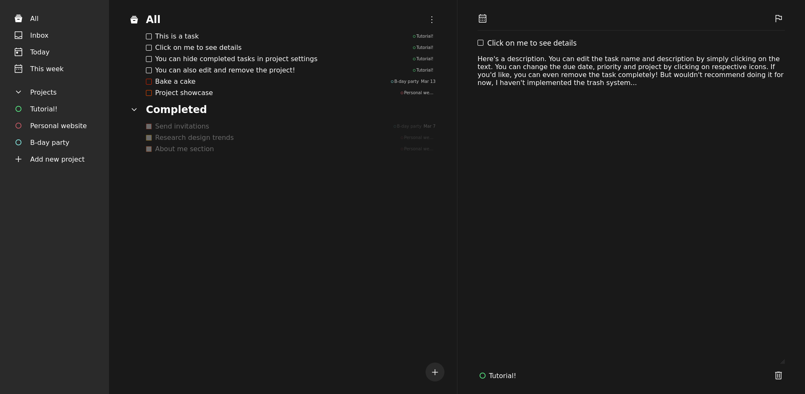

# To-Do List

## View it live [here](https://mmxwillow.github.io/to-do-list/)!

## What I've used

* ES6 modules to separate functionalities, compiled using Webpack
* Local storage for task and project objects
* [date-fns](https://date-fns.org/) for formatting dates and sorting tasks